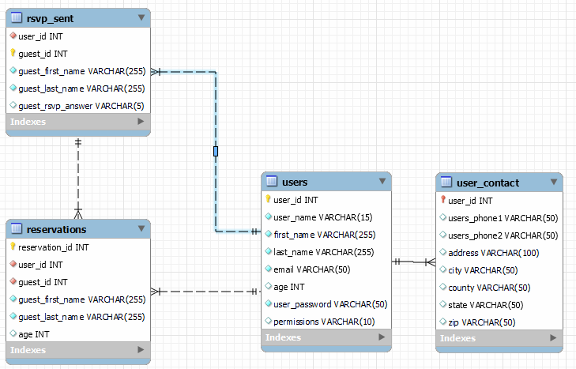

# Wedding RSVP App

DATA NEEDS??

## TABLES

PK = Primary Key  
FK = Foreign Key

## users

| user_id (PK) | user_name | first_name | last_name | email               | age | user_password     | permissions |
| ------------ | --------- | ---------- | --------- | ------------------- | --- | ----------------- | ----------- |
| 0            | kirkh99   | kirk       | davidson  | testemail@email.com | 82  | klsjdfhg;osjdhfgo | guest       |

## user_contact

| user_id(PK, FK) | users_phone1 | users_phone2 | address    | city    | county  | state | zip   |
| --------------- | ------------ | ------------ | ---------- | ------- | ------- | ----- | ----- |
| 0               | 5551234321   | 5657834697   | 202 E 34th | Lubbock | Lubbock | Texas | 79401 |

## rsvp_sent

| user_id | guest_is(PK, FK) | guest_first_name | guest_last_name | guest_rsvp_answer |
| ------- | ---------------- | ---------------- | --------------- | ----------------- |
| 0       | 1                | thomas           | smith           | true              |

## reservations

| reservation_id (PK) | user_id (FK) | guest_id (FK) | guest_first_name | guest_last_name | age |
| ------------------- | ------------ | ------------- | ---------------- | --------------- | --- |
| 2                   | 0            | 1             | Cesar            | Pizza           | 42  |

## mysql initialize file
